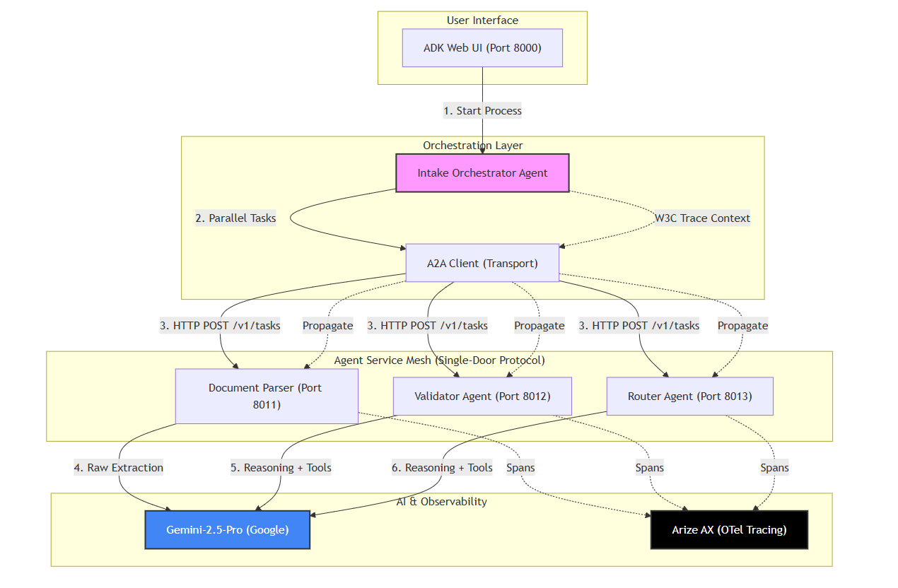

# Multi-Line Insurance Submission Intake Agent

A production-ready, multi-agent pipeline built with the **Google Agent Development Kit (ADK)** for automated insurance submission processing. This system leverages a distributed **Agent-to-Agent (A2A)** architecture to handle document parsing, validation, and underwriting routing in parallel.



## 🚀 Overview

The system automates the intake of multi-line insurance submissions (e.g., General Liability, Property, Workers Comp). It uses a specialized Orchestrator agent that delegates tasks to sub-agents hosted as microservices via HTTP (A2A).

### Key Features
- **Parallel Document Processing**: Fans out document parsing tasks to multiple A2A sub-agents.
- **Dynamic Role-Based Adapters**: Adjusts response detail and data visibility based on user profile (e.g., Clerk vs. Manager).
- **Automated Validation**: Classifies Line of Business (LOB) and validates submission completeness against pre-defined rules.
- **Arize AI Observability**: Full OpenTelemetry instrumentation for tracing agent reasoning, tool calls, and LLM performance.

---

## 📂 Project Structure

```text
├── a2a/                    # Agent-to-Agent Infrastructure
│   ├── agent_cards/        # Metadata for A2A discovery
│   ├── client.py           # Unified A2A HTTP client
│   ├── server.py           # Generic A2A host (FastAPI)
│   └── start_agents.py     # Batch launcher for A2A servers
├── agents/                 # Core Agent Logic (ADK Definitions)
│   ├── orchestrator.py     # Main Agent & Tool definitions
│   ├── document_parser.py  # PDF/JSON extraction logic
│   ├── validator.py        # LOB classification & rules
│   └── router.py           # Underwriting queue assignment
├── telemetry/              # Observability & Tracing
│   └── arize_setup.py      # Arize AX / OpenTelemetry configuration
├── tests/                  # Demo & Validation Scripts
│   └── day7.py             # End-to-end pipeline demo
├── data/                   # Input/Output Storage
│   ├── submissions/        # Raw input bundles (SUB-001, etc.)
│   └── processed/          # Final JSON reports
├── prompts/                # Versioned Prompt Templates
└── profiles/               # User Role & Preference Management
```

---

## 🛠️ Getting Started

### 1. Prerequisites
- Python 3.10+
- Google Gemini API Key
- Arize AI (Phoenix) API Keys (optional for local, required for cloud tracing)

### 2. Installation
```bash
# Clone the repository
git clone <your-repo-url>
cd Multi-Line-Submission-Intake

# Install dependencies
pip install -r requirements.txt
```

### 3. Configuration
Create a `.env` file in the root directory:
```env
GOOGLE_API_KEY=your_gemini_key
ARIZE_SPACE_ID=your_space_id
ARIZE_API_KEY=your_arize_key
```

---

## 🏃 Running the System

### Step 1: Start A2A Sub-Agents
All specialized agents (Parser, Validator, Router) must be running to receive tasks.
```bash
python a2a/start_agents.py
```
*This will launch 3 servers on ports 8011, 8012, and 8013.*

### Step 2: Launch the Agent Interface
In a new terminal, launch the ADK web interface to interact with the Orchestrator.
```bash
adk web
```
*Alternatively, you can run the batch processing script: `python tests/day7.py`*

### Step 3: View Traces
If configured, visit your **Arize AX** dashboard to see the full execution trace of the multi-agent orchestration.

---

## 🤖 Agent Roles

1. **Intake Orchestrator**: The central brain. Manages the workflow, handles user chat, and fans out tasks to A2A agents.
2. **Document Parser**: Extracts structured data from raw PDF or JSON submissions using Gemini-Flash.
3. **Validator**: Determines the Line of Business and checks for missing critical information.
4. **Router**: Assigns the submission to the correct underwriting queue and generates a natural language summary.

---

## 📜 License
This project is licensed under the MIT License - see the LICENSE file for details.
